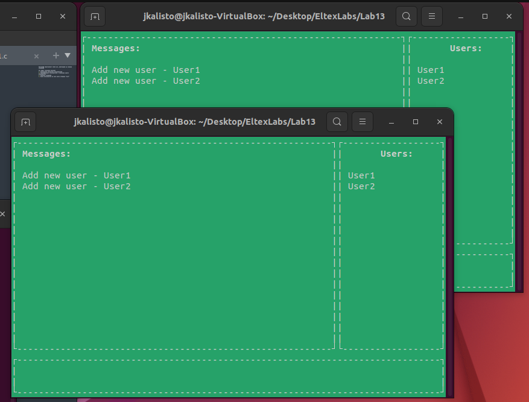
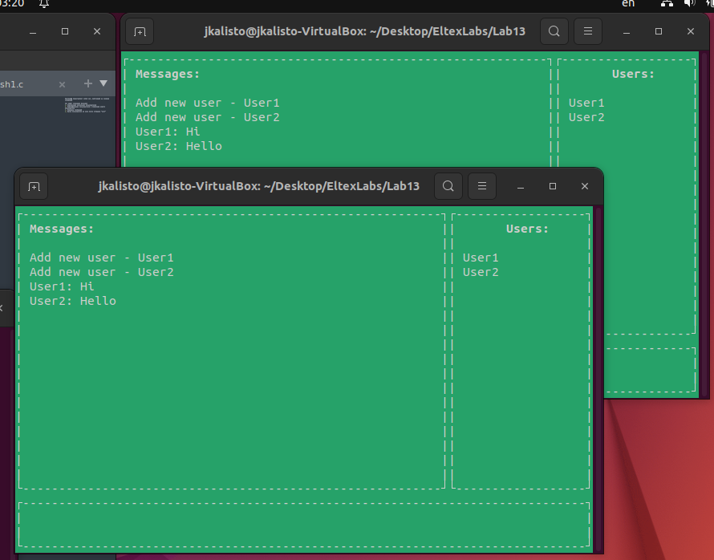
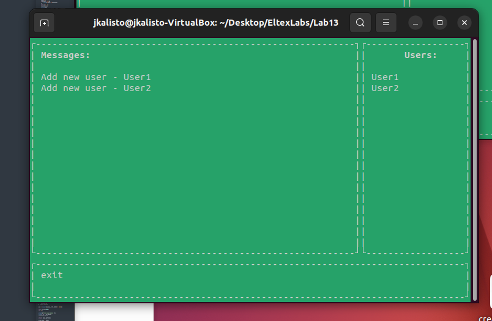
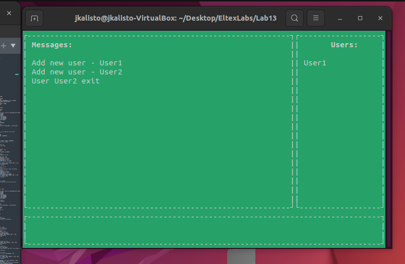

Программа представляет собой чат, работающий на очереди сообщений

Чат имеет следующие функции:
1. Подключение нескольких пользователей
2. Информирование пользователей о появлении нового пользователя

3. Передача сообщений

4. Выход пользователя из чата после отправки "exit"

