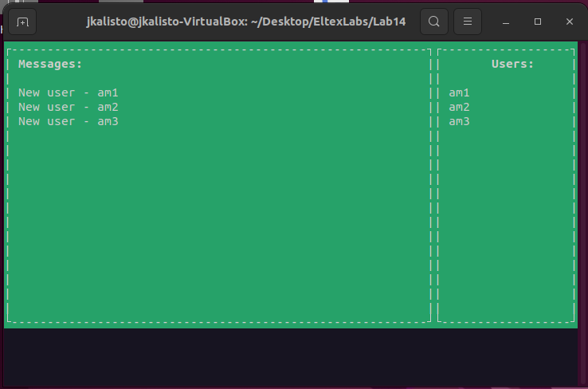
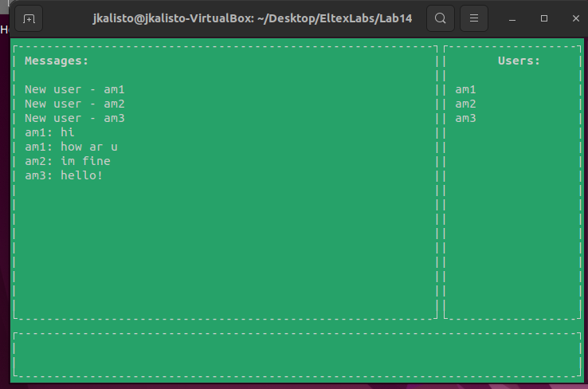
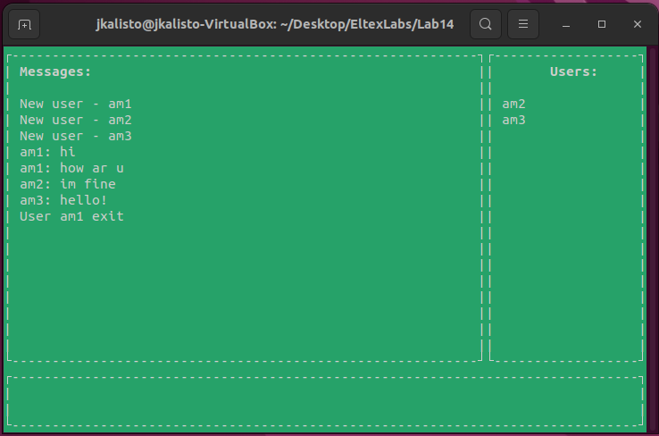

Программа представляет собой чат, работающий на очереди сообщений

Чат имеет следующие функции:
1. Подключение нескольких пользователей
2. Информирование пользователей о появлении нового пользователя
(с этим есть некоторые проблемы, подключение не всегда может произойти и лучше подключать поочередно, когда предыдущий пользователь уже получил данные)

3. Передача сообщений
(из-за метода реализации, при большом количестве пользователей, очередь на написание сообщений может не дойти до последних пользователей)

4. Выход пользователя из чата после отправки "exit"

