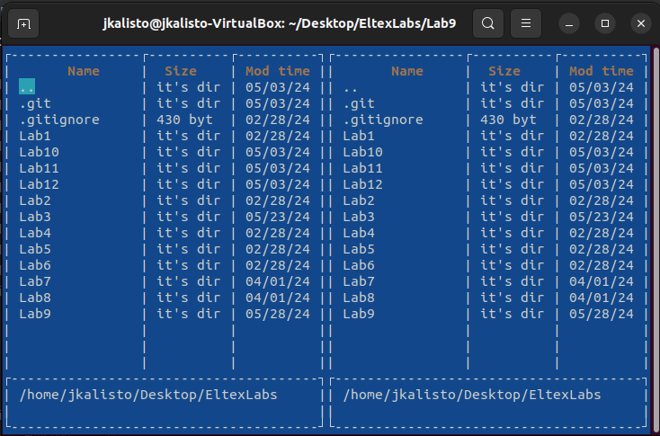
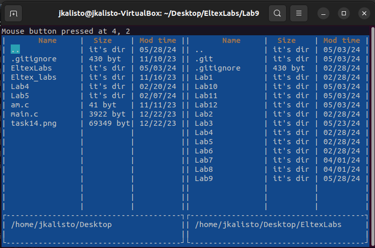
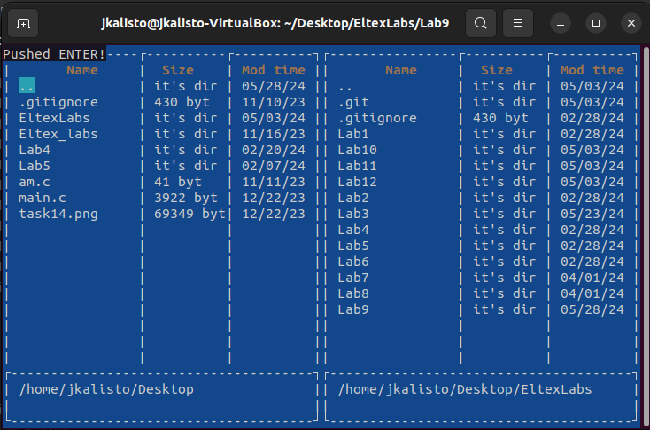
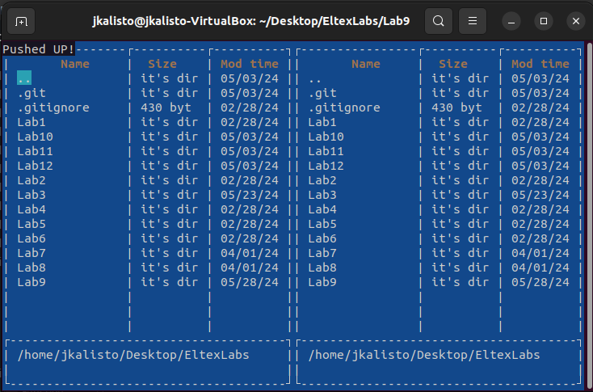
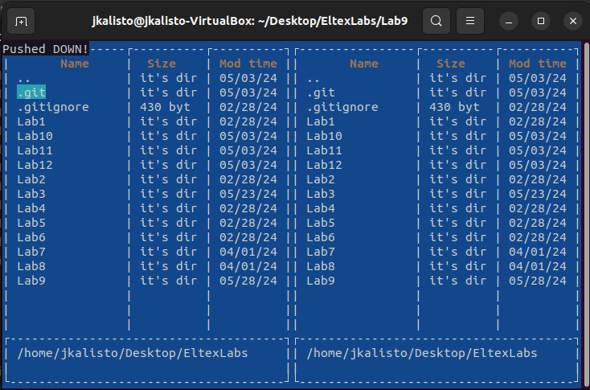
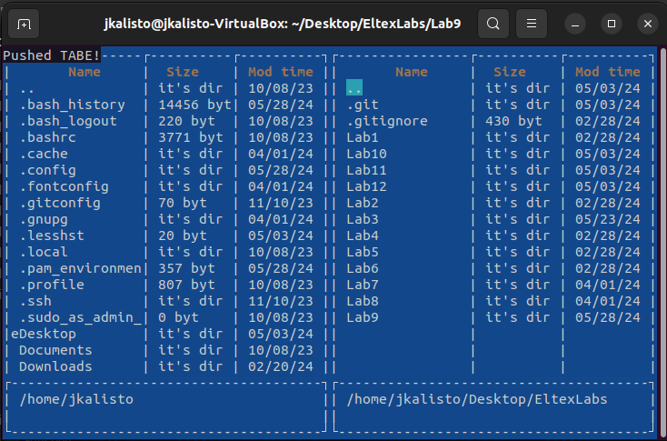

Программа реализует взаимодействия с помощью мыши и клавиатуры

* При нажатии левой кнопки мыши, либо кнопки enter, производится выход из папки

Мышь:

Enter:

* При нажатии верней или нижней стрелки производится перемещение между элементами списка

Up:

Down:

* Кнопка tab перемещает между одвумя окнами программы

