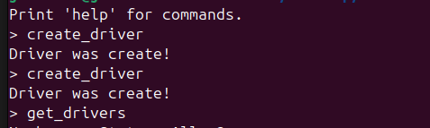
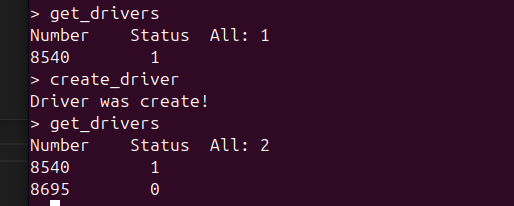
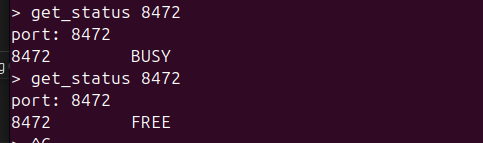
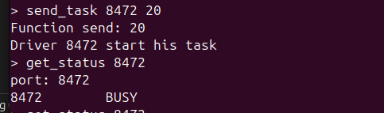
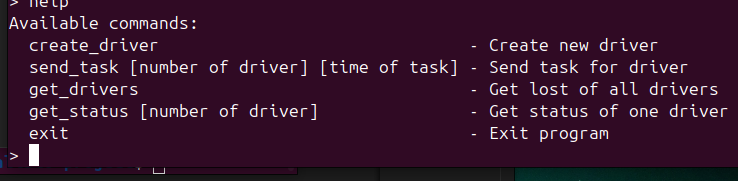
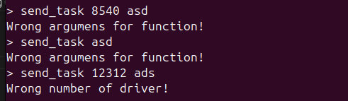

==========
Extratask 2
==========

Program can create_driver

Print list of drivers by get_drivers. All status check automatically

Print status of one driver. You need print pid of him

And send task for one driver. We need write his pid and time of his task

And we can choose help

Program has good checking for correction

